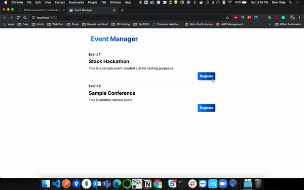
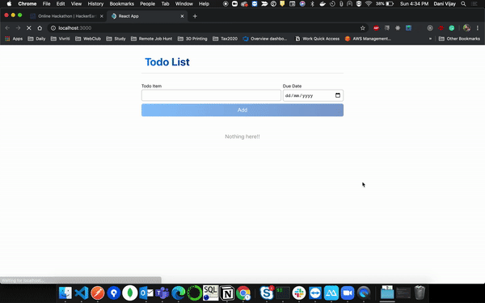

# StackHack-1.0

Make sure **NodeJS and MongoDB are installed and running**. MongoDB Atlas (https://www.mongodb.com/cloud/atlas) also can be used.

## Project 1. Event Manager

Localhost ports used: **3000, 3001, 5000**. Make sure these ports are available before proceeding

1. Go to _event-manager/event-manager-backend_ in the terminal and start the backend server by running the commands `npm i` then `npm start`. If needed, make changes in `MONGO_URI` located at _event-manager/event-manager-backend/config/config.env_. The server will be running on localhost:3001
2. Go to _event-manager/file-engine_ in the terminal and start the backend server by running the commands `npm i` then `npm start`. The server will be running on **localhost:5000**
3. Go to _event-manager/event-manager-frontend_ in the terminal and start the frontend server by running the commands `npm i` then `npm start`.
4. The project will be available on **localhost:3000**, follow the UI to proceed.

## Project 2. Todo List

Localhost ports used: **3000, 4000**. Make sure these ports are available before proceeding

1. Go to _to-do/to-do-backend_ in the terminal and start the backend server by running the commands `npm i` and `npm start`. If needed, make changes in `MONGO_URI` located at _to-do/to-do-backend/config/config.env_. The server will be running on **localhost:4000**
2. Go to _to-do/to-do-frontend_ in the terminal and start the frontend server by running the command `npm i` then `npm start`.
3. The project will be available on **localhost:3000**, follow the UI to proceed.
